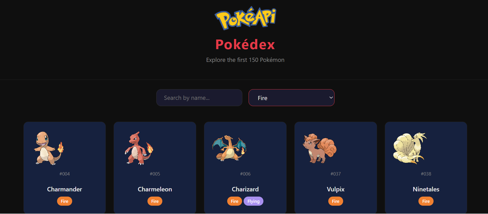

# Pokédex JS

A responsive Pokédex web app that fetches data from the PokéAPI. Built with Vanilla JavaScript, HTML, CSS and Bootstrap. No frameworks.

Una Pokédex web responsiva que consume datos de la PokéAPI. Construida con JavaScript puro, HTML, CSS y Bootstrap. Sin frameworks.



## Live Demo

[https://va-mathml.github.io/pokedex-js/](https://va-mathml.github.io/pokedex-js/)

## Features / Funcionalidades

- Browse the original 150 Pokémon / Explora los 150 Pokémon originales
- Real-time search by name / Búsqueda en tiempo real por nombre
- Filter by type (Fire, Water, Grass...) / Filtro por tipo
- Detailed modal with base stats, Pokédex description and weaknesses / Modal detallado con stats, descripción y debilidades
- Export any Pokémon card as PNG image / Exportar cualquier card como imagen PNG
- Dark mode UI / Interfaz en modo oscuro
- Fully responsive / Totalmente responsivo

## Tech Stack

- HTML5
- CSS3 (custom properties, grid, flexbox)
- JavaScript ES6+ (async/await, fetch, Promise.all, DOM manipulation)
- Bootstrap 5.3
- html2canvas (card export)
- PokéAPI v2

## What I Learned / Lo que aprendí

- Consuming RESTful APIs with fetch and handling JSON responses / Consumir APIs REST con fetch y manejar respuestas JSON
- Parallel HTTP requests with Promise.all for performance / Peticiones HTTP paralelas con Promise.all para rendimiento
- Dynamic DOM rendering without frameworks / Renderizado dinámico del DOM sin frameworks
- Client-side filtering and search logic / Lógica de filtrado y búsqueda del lado del cliente
- Converting remote images to base64 for canvas export / Convertir imágenes remotas a base64 para exportar con canvas

## Run Locally / Ejecutar localmente

```bash
git clone https://github.com/va-mathml/pokedex-js.git
cd pokedex-js
# Open index.html with Live Server or any browser
```

## Author / Autor

Victor Aguilar — [GitHub](https://github.com/va-mathml)